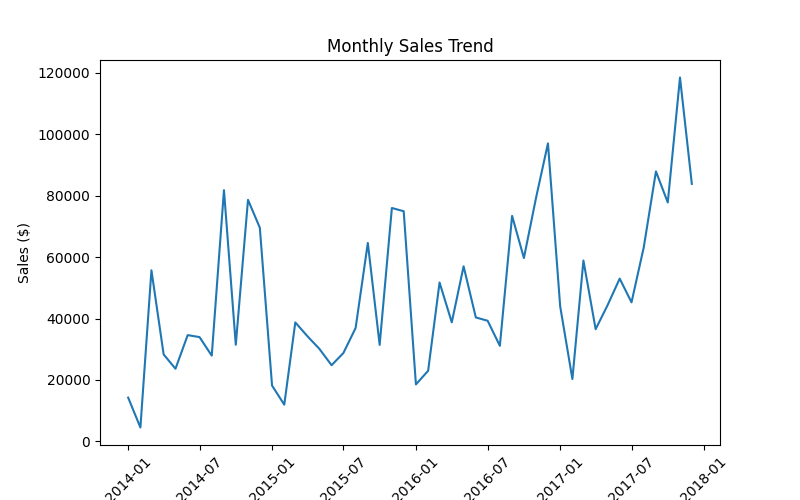
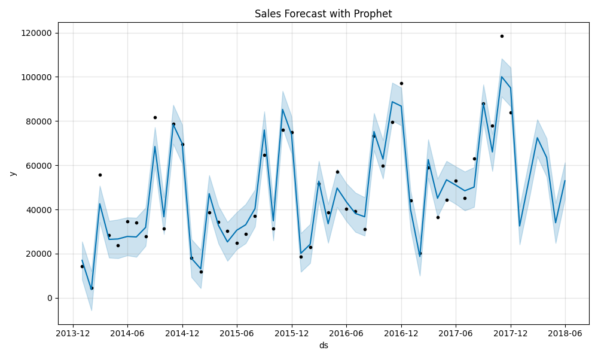
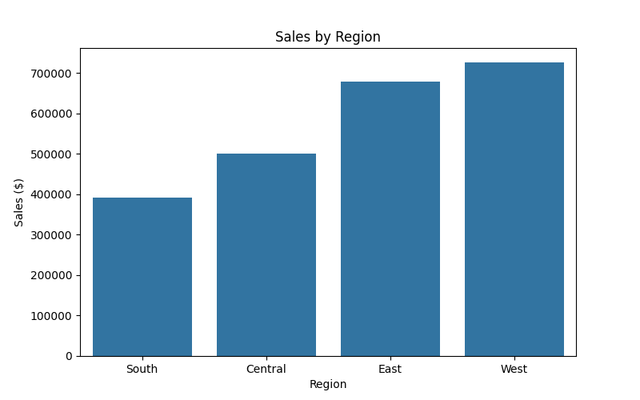
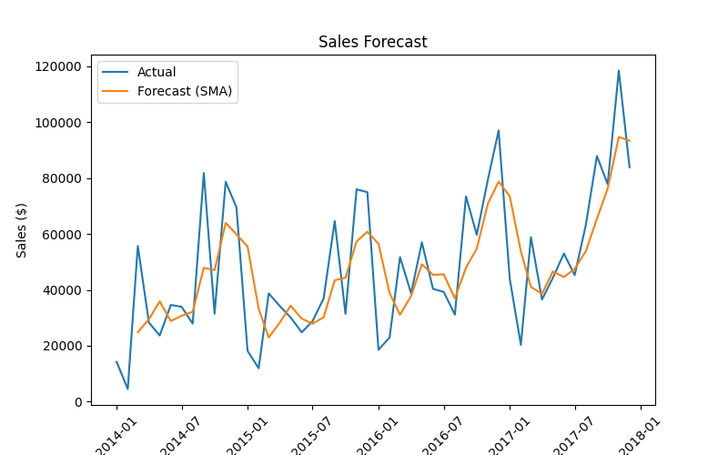
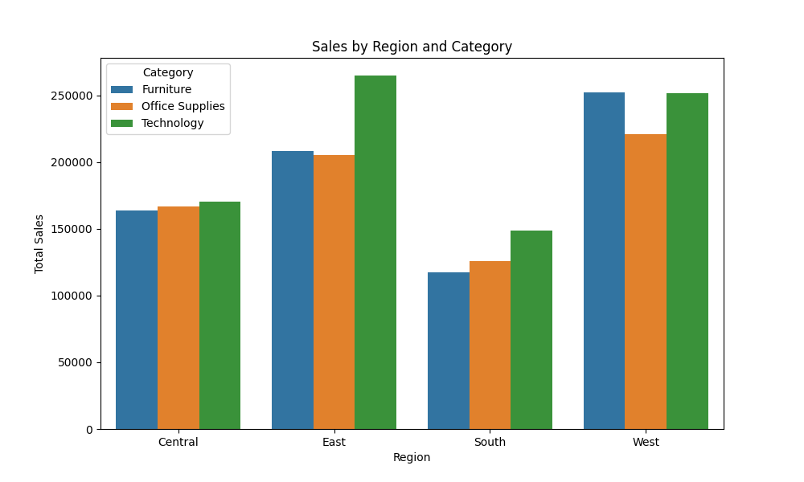

# E-Commerce Sales Intelligence Dashboard

[](https://www.python.org/)
[](https://github.com/SushminiS/Ecommerce_Sales_Intelligence_Reports)

A data analytics and visualization project built with **Python, Pandas, Matplotlib, Seaborn, and Prophet** to provide actionable business intelligence insights for e-commerce sales.  
This dashboard generates an **interactive HTML report** with KPIs, trends, forecasts, customer segmentation, and anomaly detection.

---

## 🚀 Features

- **Automated Data Cleaning** — Removes missing values and standardizes date formats.
- **Key Performance Indicators (KPIs)** — Total Sales, Total Profit, Orders, and Average Profit per Order.
- **Sales Trends** — Monthly sales trend visualization.
- **Regional Insights** — Sales by region and category segmentation.
- **Forecasting** —  
  - Simple Moving Average (SMA) for short-term trends  
  - Prophet for advanced time-series forecasting
- **Anomaly Detection** — Highlights unusual sales spikes/drops using z-scores.
- **Professional HTML Report** — Styled dashboard ready for business presentations.

---

## 📂 Project Structure

ecommerce-sales-intelligence/
├─ data/
│ └─ ecommerce_sales.csv
├─ src/
│ ├─ main.py
│ ├─ analysis.py
│ ├─ visualizations.py
│ ├─ forecasting.py
│ ├─ anomaly_detection.py
│ └─ generate_report.py
├─ report.html
├─ requirements.txt
└─ README.md


---

## 🖥️ How It Works

1. Load Data → `analysis.py`  
2. Clean Data & Calculate KPIs  
3. Generate Plots → `visualizations.py`  
4. Run Forecasts → `forecasting.py` (SMA + Prophet)  
5. Detect Anomalies → `anomaly_detection.py`  
6. Build HTML Dashboard → `generate_report.py`  

---

## 📸 Sample Dashboard Preview

 






---

## ⚙️ Installation

```bash
# Clone repository
git clone https://github.com/SushminiS/Ecommerce_Sales_Intelligence_Reports.git
cd ecommerce-sales-intelligence

# (Optional) Create virtual environment
python -m venv venv
# Windows:
venv\Scripts\activate
# Mac/Linux:
source venv/bin/activate

# Install dependencies
pip install -r requirements.txt
▶️ Usage
bash
Copy code
python src/main.py
This will:

Generate all KPIs & plots

Run sales forecasts

Detect anomalies

Save a styled report.html in your project folder

📊 Tech Stack
Python 3.9+

Pandas — Data manipulation

Matplotlib & Seaborn — Visualizations

Prophet — Time-series forecasting

Scikit-learn — Anomaly detection

HTML + CSS — Styled dashboard output

🔒 Repository Privacy
This project is private on GitHub — visible only to you and collaborators you invite.

✨ Author
Your Name
📧 sushminisunilkumar@gmail.com
💼 LinkedIn

📌 Future Improvements
Add interactive dashboard using Streamlit or Plotly Dash

Deploy report generation as a FastAPI microservice

Integrate live data from an API or database

📜 License
This project is private and not licensed for public use.